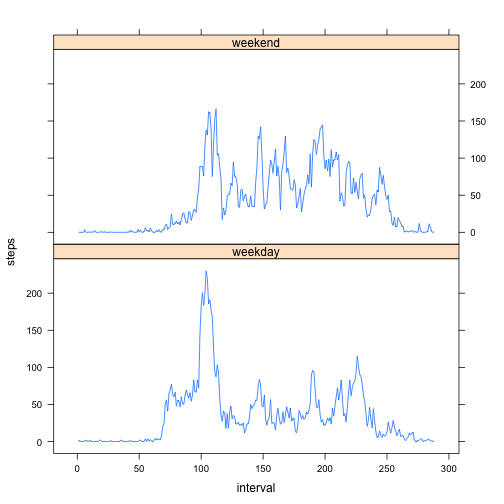

# Reproducible Research: Peer Assessment 1


## Loading and preprocessing the data

Open the zip file "activity.zip", and create a connection to the file
"activity.csv" contained inside; read the CSV data from the connection into a
data.frame called "activity".

Add a factor column to the data.frame called called `weekday` with the levels
`weekday` and `weekend`.  A few processing steps need to be taken on the `date`
column to determine if each date is a weekend day or a weekday.

1. Convert date values in Date class objects
1. Convert Date class objects in a day name string (e.g. "Monday") using the
`weekdays()` function
1. Logically test with `ifelse()` to see if the day is "Sunday" or "Saturday"
1. If the logic test is true, then use the value "weekend", else "weekday" to a
new vector
1. Factorize the new vector, and add it's contents to a new column in the
`activity` data.frame called `weekday`.


```r
library(lattice)
activity <- read.csv(
    unz("activity.zip", filename="activity.csv")
)
activity$weekday <- factor(
    ifelse(
        ((weekdays(as.Date(activity$date)) == "Saturday") | 
         (weekdays(as.Date(activity$date)) == "Sunday")),
        "weekend", "weekday")
)
```

## What is mean total number of steps taken per day?

Calculate steps per day with `by()` and `sum()`, use `sapply()` to convert the
list returned by `by()` into a integer vector.  Calculate the `mean()` and
`median()`, as well as generating a `hist()` plot of the total steps per day.

Note that if the `na.rm=TRUE` argument is passed to sum, it will result in NAs
being excluded from the sum of a particular day, where otherwise the sum for the
day would result in an NA if any value is missing.  If the entire day contains
only NAs, then sum calculates a `0` value, which is a little misleading when
calculateing statistics on the summed vector.

Alternatively, we can only drop NAs from the sum if there is at least one
non-NA value in the day, which results in a step count that represents all the
steps which were recorded.  For days that are all NAs, we could then indicate
the day's step count sum as NA.  I will provide the result of using both
methods.

### NAs dropped while summing, and NA-only days resulting in 0


```r
stepsPerDay <- sapply(
    with(activity,
        by(steps, date, sum, na.rm=TRUE)
    ),
    function (x) x
)
mean(stepsPerDay)
```

```
## [1] 9354
```

```r
median(stepsPerDay)
```

```
## [1] 10395
```

```r
hist(stepsPerDay)
```

 

### NAs dropped only if there is at least one non-NA value


```r
stepsPerDay <- sapply(
    with(activity,
        by(steps, date, function (x) {
            if (all(is.na(x))) {
                return(NA)
            }
            else {
                sum(x, na.rm=TRUE)
            }
        })
    ),
    function (x) x
)
mean(stepsPerDay, na.rm=TRUE)
```

```
## [1] 10766
```

```r
median(stepsPerDay, na.rm=TRUE)
```

```
## [1] 10765
```

```r
hist(stepsPerDay)
```

 

The assignment states "you can ignore the missing values in the dataset",
but it does not prescribe how.  I saw two possible methods to ignore the missing
values and presented both.  I believe the latter method to be more accurate,
since it doesn't result in ignoring data from days that have some missing
values.

## What is the average daily activity pattern?

To calcuate the average steps taken across all days at each interval I used the
`by()` function, subsetting the data on each interval.  NAs are ignored.  The
result of the `by()` function is an object of type `by` (similar to a `list`).
Dereferencing this object with the `[]` operator returns a vector of the
calculated steps, each corresponting to an interval.

Rather than using the actual interval value on the X axis, I chose to use the
index of the interval instead (e.g., interval 0 == index 0, interval 5 == index
1, interval 100 == index 13).  The reason I did this is that the intervals jump
from the value '55' to '100' to indicate an hour, which means the inerval is
really a coded value where the first one or two digis are the hour, and the
second two digits are the minutes of the hour.  This will create similar jumps
on the graph from interval 55 to 100 which would appear as if 9 intervals had
passed between two interval datapoints.  Using the index value instead solves
this problem.  These jumps can be observed by changing the graph type to
points, and making your graph window really wide, while using the interval
values along the X axis. The X axis can then be marked after plotting by
disabling axes generation in `plot()`, and drawing them with `axis()`.


```r
intervals <- with(activity, by(steps, interval, mean, na.rm=TRUE))
plot(intervals[], xlab="Interval (index)", ylab="Ave Steps", 
     main="Average steps per day by interval", type="l", axes=FALSE)
axis(1,
     labels=names(intervals[])[seq(from=1, to=288, by=60)], 
     at=seq(from=0, to=288, by=60)
     )
axis(2)
```

 

```r
for (interval in names(intervals[]))
     if (max(intervals[]) == intervals[interval])
         print(paste(
             "Average daily interval with the most steps:", interval,
             "with a value of:", intervals[interval]))
```

```
## [1] "Average daily interval with the most steps: 835 with a value of: 206.169811320755"
```

## Inputing missing values

### Total missing values:


```r
missingSteps <- sum(is.na(activity$steps))
print(missingSteps)
```

```
## [1] 2304
```

### Missing values by day:


```r
table(by(activity$steps, activity$date, function(x) { sum(is.na(x))} ))
```

```
## 
##   0 288 
##  53   8
```

It looks like 53 days have no missing step data, and 8 days are missing all step
data.  No days have only partial data.

### Missing value strategy

Fill in missing values per interval with the mean of the interval.

1. Iterate over each interval using the `by()` function.
1. Using the `ifelse()` function, selectively replace NAs with the mean of that
interval.  The resulting by object will be in list form, where each index of the
list is the interval (e.g. `iSteps[["0"]], iSteps[["5"]] for intervals 0 and 5).
1. copy activity into a new variable, cleanActivity
1. Using a for loop, replace each interval in the cleanActivity data.frame with
the values in iSteps. (it's possible to directly replace the vector in
cleanActivity with the vector in iSteps, however I was worried they wouldn't be
in exactly the same order.  To be on the safe side I used the for loop with
explicit indexing)


```r
iSteps <- with(activity,
     by(steps, interval, function (x) {
         ifelse(
                is.na(x),
                as.integer(mean(x, na.rm=TRUE)),
                x)
     })
)
cleanActivity <- activity
for (i in names(iSteps))
    cleanActivity$steps[cleanActivity$interval == i] <- iSteps[[i]]
```

Total steps per day after filling in the missing data


```r
stepsPerDay <- sapply(
    with(cleanActivity,
        by(steps, date, sum)
    ),
    function (x) x
)
mean(stepsPerDay, na.rm=TRUE)
```

```
## [1] 10750
```

```r
median(stepsPerDay, na.rm=TRUE)
```

```
## [1] 10641
```

```r
hist(stepsPerDay)
```

 

These values appear to be pretty close to the second method of ignoring the NAs
shown above, but are a little lower.
## Are there differences in activity patterns between weekdays and weekends?

Now for some VOODOO to calculate the average steps per day type (weekday vs
weekend).  There is probably a more effecient way to do this in R, but so far
it's the only way I could determine to get the data into the format I wanted.

1. use `by()` again to subset, except this time on both weekday and interval.
This will effectively break steps up into subsets by weekday and interval, then
calculate the mean on each subset.  A two-dimensional `list()` is returned with
weekday as the first dimension, and interval as the second dimension with the
mean steps for that interval/weekday pair as the value.

2. convert the data back into a data.frame by explicitely referring to each 
value of weekday.  There is probably an apply function to do this magically,
but I ran out of time to figure out which it is.  Probably tapply.  Anyways,
here is some crap that still works.  Recombine the two subset dataframes with
rbind.

3. use xyplot to show the ave steps per interval for weekend days and weekdays
using the index of the interval, rather than the actual interval value as before
since the interval values jump at the edge of each hour.  Note that this results
in the x value range being 1 to 288 instead of 0 to 2355, but is representing
the same thing.  I don't know how to do the axes relabeling trick with lattice
:(

4. In addition to the plots, I found that a summarization of the weekend and
weekday data underscores the difference between the walking patters.


```r
aveStepsDayList <- with(cleanActivity, by(steps, list(weekday, interval), mean))
aveStepsDay <- rbind(
    data.frame(
        interval=1:length(names(aveStepsDayList["weekday", ])),
        steps=as.numeric(aveStepsDayList["weekday", ]),
        weekday=rep("weekday", length(aveStepsDayList["weekday", ]))
    ),
    data.frame(
        interval=1:length(names(aveStepsDayList["weekend", ])),
        steps=as.numeric(aveStepsDayList["weekend", ]),
        weekday=rep("weekend", length(aveStepsDayList["weekend", ]))
    )
)
xyplot(steps ~ interval | weekday, data=aveStepsDay, layout=c(1,2), type="l")
```

 

```r
with(aveStepsDay, tapply(steps, weekday, summary))
```

```
## $weekday
##    Min. 1st Qu.  Median    Mean 3rd Qu.    Max. 
##    0.00    2.16   25.70   35.60   50.80  230.00 
## 
## $weekend
##    Min. 1st Qu.  Median    Mean 3rd Qu.    Max. 
##    0.00    1.19   32.30   42.30   74.60  167.00
```
